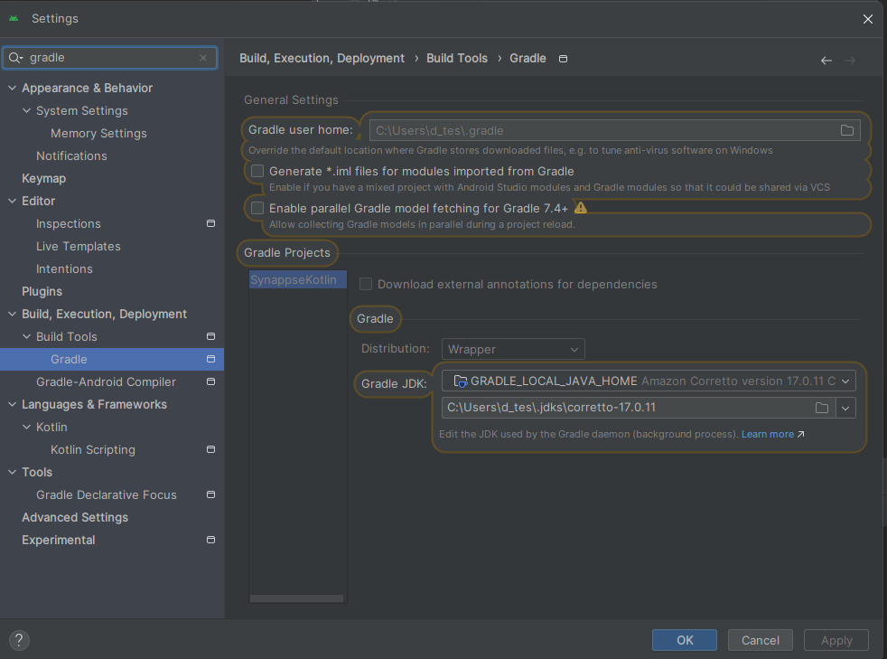
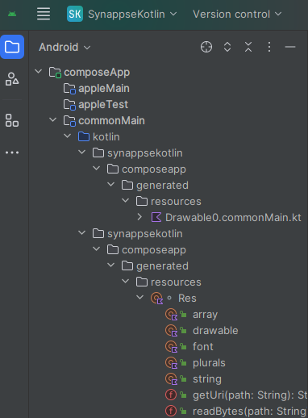
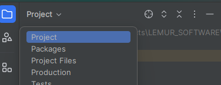
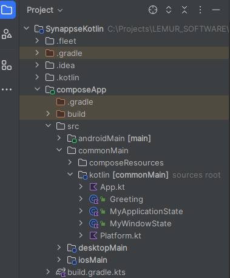
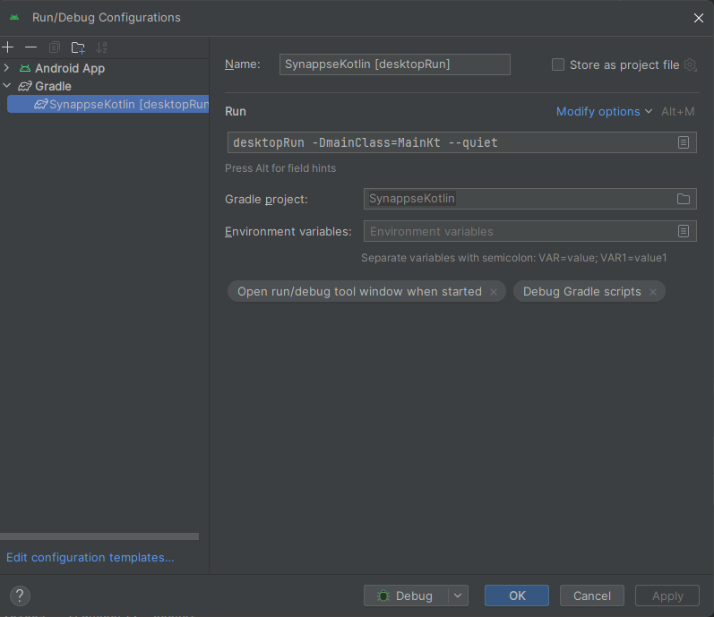
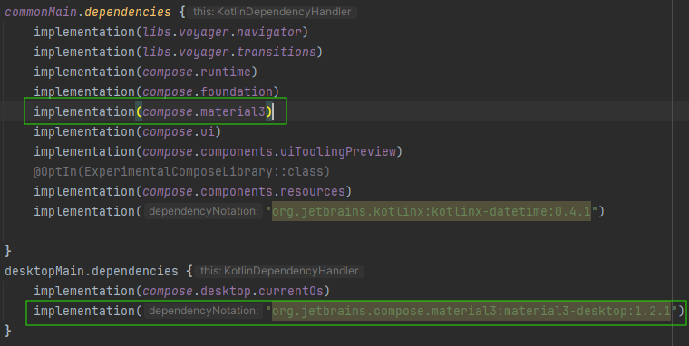

This is a Kotlin Multiplatform project targeting Android, iOS, Desktop.

* `/composeApp` is for code that will be shared across your Compose Multiplatform applications.
  It contains several subfolders:
  - `commonMain` is for code that’s common for all targets.
  - Other folders are for Kotlin code that will be compiled for only the platform indicated in the folder name.
    For example, if you want to use Apple’s CoreCrypto for the iOS part of your Kotlin app,
    `iosMain` would be the right folder for such calls.

* `/iosApp` contains iOS applications. Even if you’re sharing your UI with Compose Multiplatform, 
  you need this entry point for your iOS app. This is also where you should add SwiftUI code for your project.


Learn more about [Kotlin Multiplatform](https://www.jetbrains.com/help/kotlin-multiplatform-dev/get-started.html)…

# KOTLIN MULTIPLATFORM

## CONFIGURACIONES INICIALES

Asegurar la versión de Gradel utilizada dese aqui:




Debemos cambiar la vista de proyecto por esta otra para evitar esa estructura tan verbosa:



Por esta otra






## CONFIGURACIÓN DE DEPURACIÓN PARA ESCRITORIO

Para depuración en Escritorio Editar configuración y añadir 
  
    desktopRun -DmainClass=MainKt --quiet




# CONFIGURACIÓN DE VOYAGER

Voyager es una librería que gestiona internamente el flujo de navegación de nuestra aplicación.

https://voyager.adriel.cafe/


# CONFIGURACIÓN PARA EL USO DE MATERIAL 3

En el fichero ```build.gradle.kts```

