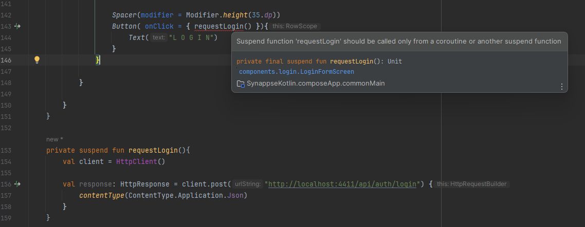
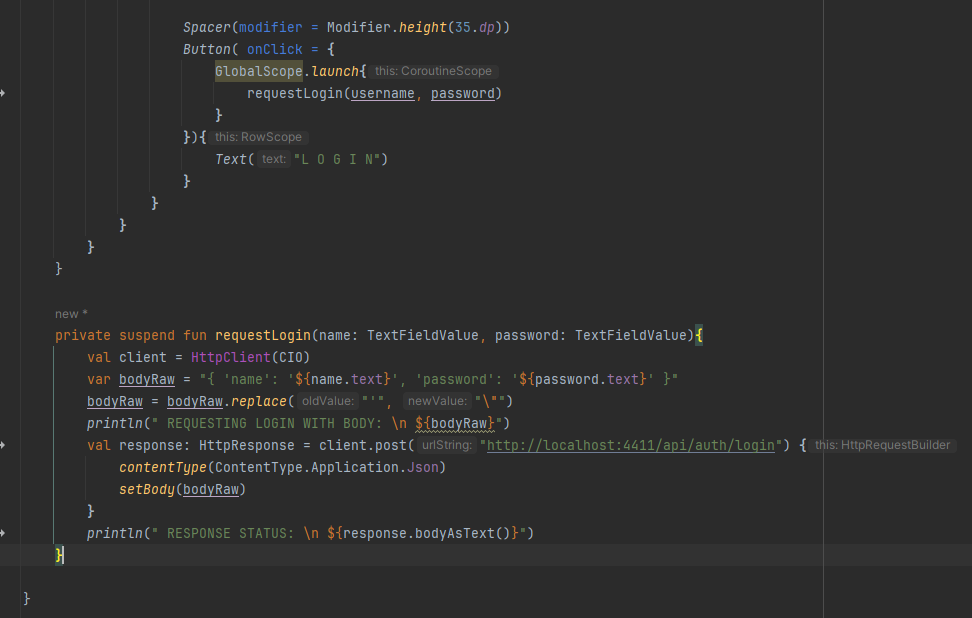
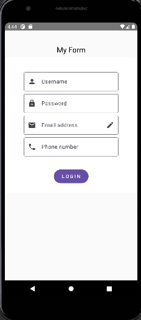

# KOTLIN MULTIPLATFORM

This is a Kotlin Multiplatform project targeting Android, iOS, Desktop.

* `/composeApp` is for code that will be shared across your Compose Multiplatform applications.
  It contains several subfolders:
  - `commonMain` is for code that’s common for all targets.
  - Other folders are for Kotlin code that will be compiled for only the platform indicated in the folder name.
    For example, if you want to use Apple’s CoreCrypto for the iOS part of your Kotlin app,
    `iosMain` would be the right folder for such calls.

* `/iosApp` contains iOS applications. Even if you’re sharing your UI with Compose Multiplatform, 
  you need this entry point for your iOS app. This is also where you should add SwiftUI code for your project.


Learn more about [Kotlin Multiplatform](https://www.jetbrains.com/help/kotlin-multiplatform-dev/get-started.html)…

## CONFIGURACIONES INICIALES

Asegurar la versión de Gradle utilizada dese aqui:


Debemos cambiar la vista _Android_ del proyecto por la de _Project_ para evitar esa estructura tan verbosa:


Por esta otra


## CONFIGURACIÓN DE DEPURACIÓN PARA ESCRITORIO

Para depuración en Escritorio Editar configuración y añadir 
  
    desktopRun -DmainClass=MainKt --quiet


  ### VISTA DE LOGIN EN ESCRITORIO

  


## CONFIGURACIÓN DE VOYAGER

Voyager es una librería que gestiona internamente el flujo de navegación de nuestra aplicación.

https://voyager.adriel.cafe/

En el fichero ```libs.veriosn.toml```


En el fichero ```build.gradle.kts```


## CONFIGURACIÓN PARA EL USO DE MATERIAL 3

En el fichero ```build.gradle.kts```


## KTOR CLIENT HTTP REQUESTS 

Primero se muestra como hacer una petición en crudo con un content-type como JSON en formato string.

1. Tenemos que incluir el cliente KTOR en nuestras dependencias en ```libs.veriosn.toml```

    

2. Incluímos la __implementation__ en el ```build.gradle.kts_```

    

3. También las dependencias correspondientes

    

4. Definimos el cliente y planteamos la petición. Per antes, para resolver el inconveniente de tener que llamar a una función __suspend__  desde una corutina 

    Suspend Function In Kotlin-Coroutines
    https://dev.to/saketh/suspend-function-in-kotlin-coroutines-2epi

    

    Para solucionarlo tenemos que utilizar la dependencia de corutinas de Kotlin, como siempre en el buid.gradle.kts

        implementation("org.jetbrains.kotlinx:kotlinx-coroutines-android:1.5.0")

      

    Definitivamente implementamos la llamada a la función ```__suspend__ __fun__ requestLogin(){}``` (en este caso construimos el json string body a mano), desde dentro de un GlobalScope

    

    ### CONSIDERACIONES EN ANDROID

      Aunque en escritorio esto nos funciona correctamente veremos que en Android tenemos que habilitar el permiso para la conexión a internet y también permitir el tráfico de texto

      

      Tampoco nos vale con poner localhost a la ruta de nuestro API. En mi caso es una aplicación node corriendo localmente.Haremos uso del ```ipconfig``` para configurarla así. La podemosm dejar así porque para escritorio también funcionará con la ip ;)

      

      

      

      En la parte del __logcat__ veremos esta salida que es la misma obviamente que en la parte de escritorio.
      
      

    ### EJEMPLOS DE RESPUESTA A PETICIONES HTTP

    

    ### KOTLIN JSON SERIALIZER (La forma correcta)

    Tenemos que adaptar la forma de cargar el plugin e incluir la dependencia de forma genérica para nuestras aplicaciones.

    A fecha de hoy Junio de 2024 me he decidido por utilizar una versión estable y con un número razonable de descargas para evitar incompatibilidades. Sugiero visitar como en mi caso para obtener una versión con estas características en el momento en el que se quiera llevar a cabo la implementación, aunque se deja TODO para actualziar a versión más reciente

    https://mvnrepository.com/artifact/org.jetbrains.kotlinx/kotlinx-serialization-json-jvm

    

    Desde esta issue https://stackoverflow.com/questions/60464552/kotlinx-serialization-class-marked-serializable-does-not-have-the-serializer he decido navegar al enlace "add the plugin"  

    Aquí, en teoría, se explica como añadir dependencias para Kotlin Multiplatform https://github.com/Kotlin/kotlinx.serialization?tab=readme-ov-file#using-the-plugins-block. Pero realmente tenemos que hacer algunos cambios para poder aplicarlo a nuestra sintaxis y estructura en nuestros ficheros de configuración que son estos:

    

    Vamos a cambiar esto en nuestro fichero ```libs.versions.toml```:

        plugins {
            kotlin("jvm") version "2.0.0" // or kotlin("multiplatform") or any other kotlin plugin
            kotlin("plugin.serialization") version "2.0.0"
        }
    
    Por esto otro:

        [plugins]
        /... Otros plugins previos aquí.../
        kotlinMultiplatform = { id = "org.jetbrains.kotlin.multiplatform", version.ref = "kotlin" }
        kotlinSerialization = { id = "org.jetbrains.kotlin.plugin.serialization", version.ref = "kotlin" }

    Y vamos a añadir la dependencia de kotlinx.serialization de forma común a todas las plataformas en nuestro ```build.gradle.kts``` esto:

        plugins {
            alias(libs.plugins.kotlinMultiplatform)
            alias(libs.plugins.kotlinSerialization) // Puedes cambiar el nombre de 'kotlinSerialization' pero 
                                                    // asegúrate de hacerlo igualmente en el ```libs.versions.toml```
        }

    Y también por último añadir la dependencia a nuestras implementations con la versión que decidimos escoger inicialmente:

            commonMain.dependencies {

              <... otras dependencias ...>

              //KTOR (...ver arriba)
              implementation("io.ktor:ktor-client-core:2.3.11")
              implementation("io.ktor:ktor-client-cio:2.3.11")
              implementation("io.ktor:ktor-client-content-negotiation:2.3.11") // Reemplaza con la versión más reciente
              implementation(libs.ktor.client.core)
              implementation(libs.ktor.client.okhttp)

              // SERIALIZATION
              implementation("io.ktor:ktor-serialization-kotlinx-json:2.3.11") // Reemplaza con la versión más reciente
              implementation("org.jetbrains.kotlinx:kotlinx-serialization-json:1.6.1") // Reemplaza con la versión más reciente
            }

    Ahora ya podemos hacer la petición serializando y desearializando los Json sin problema. 

    Recuerda que el modelo a serializar sería definido de la siguiente forma en la clase correspondiente

    

    IMPORTANTE!!! No olvides añadir __val__ previo al nombre de cada variable de clase.

    ## CONSIDERACIONES SOBRE LA PETICIÓN

    Así pues, ahora mismo con ktor como cliente podemos realizar peticiones y procesarlas en formato Json con nuestro serializator de Kotlin. Esta sería la estructura de una petición POST de ejemplo.

    

